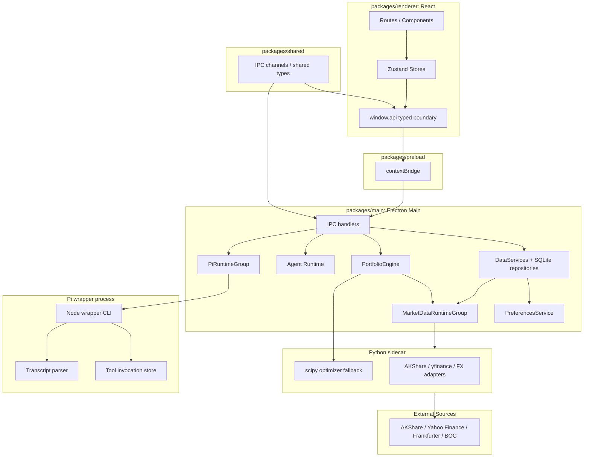
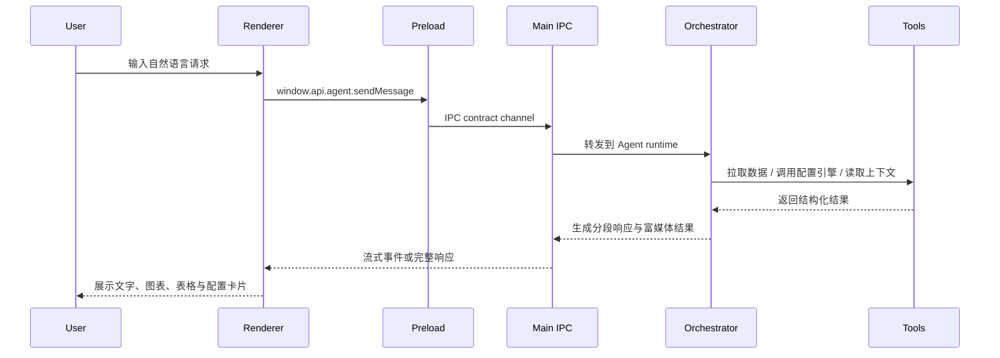
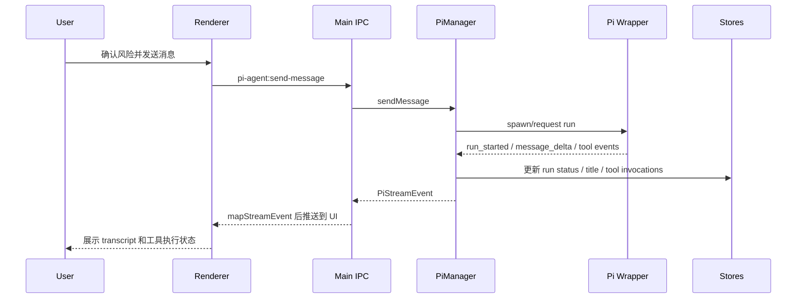

# QuantDesk 项目规格说明

| 项目 | 内容 |
| --- | --- |
| 名称 | QuantDesk |
| 当前阶段 | Phase 1 / MVP Implementation |
| 文档类型 | Project Spec / Implementation Snapshot |
| 状态 | In Progress |
| 更新时间 | 2026-04-27 |

## 1. 项目概述

### 1.1 一句话定义

**QuantDesk** 是一款面向个人投资者的 macOS 智能金融桌面工具，基于 Electron + React 构建，提供本地优先的资产池管理、历史行情同步、组合分析与 AI Agent 辅助决策能力。Phase 1 聚焦 **全天候资产配置方案生成器**，并把标的搜索、价格同步、组合优化和结果解释打通成一条本地可复盘的工作流。

### 1.2 核心问题

- 个人投资者缺少统一管理多类资产、组合配置与风险分析的本地工具。
- 市场数据分散在多个入口，手工拼接成本高，难以形成稳定工作流。
- 全天候、风险平价等配置方法理解门槛高，现有工具要么过度专业，要么过度简化。
- 通用 AI 工具缺少与投资组合、市场数据和本地决策上下文的深度耦合。

### 1.3 目标用户

目标用户是具备一定金融素养的个人投资者、独立交易者与策略爱好者。他们希望用更工程化的方式完成这些任务：

- 维护自己的可投资标的池
- 基于约束条件生成配置方案
- 理解组合的风险暴露与情景表现
- 在 AI 辅助下形成稳定的投资研究流程

## 2. Phase 1 范围与当前进度

### 2.1 MVP 目标

用户从候选标的池中选择资产后，QuantDesk 能够：

1. 拉取并缓存历史价格数据
2. 运行配置引擎生成权重方案
3. 输出风险指标、情景分析与可视化结果
4. 通过 AI Agent 给出结构化解释与审查意见
5. 将结果保存在本地，供后续复盘与调整

### 2.2 In Scope

- 标的池管理：搜索、添加、删除、批量导入
- 配置模式：风险平价、目标波动率、最大夏普
- 约束设置：单标的上限、大类上限、是否允许杠杆或做空
- 结果展示：权重表、仓位图、风险贡献、相关性热力图、情景分析
- AI Agent：资产分析、风险分解、配置生成、宏观扫描、再平衡建议
- Pi Agent：高权限本地 Agent runtime、附件上下文、工具调用流式状态和风险确认门槛
- 本地数据层：SQLite 持久化、缓存与用户偏好保存

### 2.3 Out of Scope

- 券商 API 下单与自动交易
- 实时行情推送
- 多终端同步
- 多组合协作管理
- 完整回测与归因分析平台

### 2.4 当前实现状态

| 模块 | 当前状态 | 说明 |
| --- | --- | --- |
| Renderer 工作台 | 已进入可用实现 | 页面、组件、store 通过 typed `window.api` 边界访问运行时能力，普通组件不再直接 import `src/dev/`。 |
| 标的池与市场数据 | 已进入可用实现 | 主进程通过 market-data runtime group 组合搜索、价格同步、缓存、CSV 导入和 metadata backfill。 |
| 配置引擎 | 已进入可用实现 | `PortfolioEngine` 通过 market-data orchestrator 准备价格数据，并按规模选择 JS 或 Python sidecar 优化路径。 |
| 本地偏好 | 已集中化 | 主进程偏好键收敛到 `preference-keys.ts`，读取逻辑走 `createPreferencesService(...)`。 |
| Pi Agent runtime | 已拆分并可测试 | `PiManager` 负责生命周期编排，运行状态、标题元数据、事件分发、IPC handler、附件 prompt 和工具调用持久化已拆到独立模块。 |
| Lint 架构约束 | 已落地 | 本地 `eslint-plugin-quantdesk` 负责静默 catch、直接 SQL、runtime 动态 import、raw interactive elements、renderer dev import 等边界。 |
| Electron E2E 探针 | 已接入 | E2E 探针覆盖 dev app 启动、资产池、Pi runtime 等关键路径；Pi agent probe 在缺少外部条件时按现有配置跳过。 |

### 2.5 成功标准

- 用户可在单机环境中完成“选资产 -> 设约束 -> 生成配置 -> 查看 AI 解读 -> 保存方案”的完整链路。
- 20 个标的以内的配置计算具备可接受的交互时延。
- 数据、会话与偏好默认本地保存。
- Agent 输出绑定明确的数据上下文，而不是纯文本泛化建议。
- 高权限 Pi Agent 在发送消息前必须经过风险确认，并保留可追溯的工具调用记录。

## 3. 系统架构

### 3.1 整体架构



### 3.2 技术选型

| 层级 | 技术 | 选择原因 |
| --- | --- | --- |
| 桌面容器 | Electron | 成熟、跨平台，适合整合本地能力与前端 UI。 |
| 前端 | React + TypeScript + Vite | 开发体验好，适合交互式桌面界面。 |
| UI | TailwindCSS + 可组合组件体系 | 适合构建密集但可扫描的桌面工作台。 |
| 状态管理 | Zustand | 轻量，适合 Electron + IPC 的状态同步模型。 |
| 本地存储 | better-sqlite3 / SQLite | 本地优先、零服务依赖，适合缓存和持久化。 |
| 数据运行时 | MarketDataRuntimeGroup | 在 composition root 组装 sidecar runtime、market-data services 和 orchestrator。 |
| AI 运行时 | Agent Runtime + Pi Runtime | 普通金融工具编排与高权限本地 Agent 分开治理。 |
| 模型提供方 | OpenAI / Claude / Ollama | 同时覆盖云端质量、本地隐私和本地模型运行。 |
| 数据计算兜底 | Python sidecar | 负责标的搜索、历史行情、FX 同步和重计算兜底，便于接入 AKShare、Yahoo Finance、scipy 等生态。 |

### 3.3 模块边界

- **Renderer**：页面路由、可视化、表单配置、Agent 面板，只通过 typed preload API 访问运行时能力。
- **Preload**：通过 `contextBridge` 暴露 `window.api`，不承载业务逻辑。
- **Shared contracts**：维护 IPC 通道、共享类型、运行时 contract 和核心输入输出结构。
- **Main Process**：IPC 注册、数据访问、配置计算、偏好服务、Agent 编排和 sidecar 生命周期。
- **Python sidecar**：标的搜索、行情抓取、FX 同步、重计算兜底和未来算法扩展。
- **Pi wrapper process**：隔离高权限本地 Agent 的执行环境，负责 transcript、工具调用和附件上下文处理。

这个边界让 UI、业务编排和重计算能力保持解耦，也让高权限 Agent 的状态和工具调用可被单独测试。

### 3.4 Renderer Runtime Boundary

- Renderer 的页面、store 和组件层只能通过 `window.api` 访问运行时能力，不能直接 import `src/dev/` 下的私有实现。
- Electron 模式下，`window.api` 由 preload 注入，并通过 IPC 调用 main 进程的真实 service。
- 浏览器调试模式下，`window.api` 仍保持同一份 typed contract，底层 transport 改为 WebSocket bridge。
- 浏览器模式只保留 transport/bootstrap 与 mock 夹具，不在 renderer 内维护影子业务逻辑。
- 这条边界由 `quantdesk/no-renderer-dev-imports` 检查，路径别名、相对导入和 re-export 都纳入同一规则。

## 4. 核心功能模块

### 4.1 标的池管理

用户维护配置引擎的输入资产池。Phase 1 支持以下大类：

| 资产大类 | 示例 |
| --- | --- |
| 权益 | 沪深 300 ETF、恒生科技 ETF、SPY、QQQ |
| 固收 | 国债 ETF、信用债 ETF、可转债 ETF |
| 商品 | 黄金 ETF、原油基金 |
| 另类 | REITs、通胀挂钩债券 |
| 现金等价 | 货币基金、短期国债 |

关键数据结构：

```ts
interface Asset {
  id: string;
  symbol: string;
  name: string;
  market: "A" | "HK" | "US" | "BOND" | "COMMODITY";
  assetClass: "equity" | "fixed_income" | "commodity" | "alternative" | "cash";
  currency: "CNY" | "HKD" | "USD";
  tags: string[];
  metadata?: Record<string, unknown>;
}
```

### 4.2 全天候配置引擎

配置引擎是 Phase 1 的核心能力，支持三种模式：

- **风险平价**：按风险贡献而非名义资金权重配置。
- **目标波动率**：在风险目标约束下调整仓位。
- **最大夏普**：在历史收益与波动假设下寻找更优风险收益比。

生成流程：

1. 用户选择标的池。
2. MarketDataOrchestrator 确认可用历史价格，必要时触发同步。
3. PortfolioEngine 读取 display series 与 adjusted series，计算收益率、协方差和相关性。
4. 按配置模式运行优化器，小规模场景可走 TypeScript 路径，大规模或需要 scipy 时回退 Python sidecar。
5. 应用约束条件并生成结果。
6. 输出图表、指标与 AI 审查意见。

关键输出结构：

```ts
interface AllocationResult {
  weights: Record<string, number>;
  riskContributions: Record<string, number>;
  portfolioMetrics: {
    expectedReturn: number;
    volatility: number;
    sharpeRatio: number;
    maxDrawdown: number;
  };
  scenarioAnalysis: Array<{
    name: string;
    estimatedReturn: number;
    estimatedDrawdown: number;
    riskFactors: string[];
  }>;
}
```

### 4.3 AI Agent 与 Pi Runtime

Agent 负责把自然语言请求转成结构化的分析流程。它不是单纯聊天入口，而是围绕市场数据、配置结果与用户上下文运行的工作流协调层。

Phase 1 核心 Skill：

| Skill | 作用 |
| --- | --- |
| `asset-analysis` | 基于本地价格序列分析单个标的的收益与波动特征，不包含基本面。 |
| `risk-decompose` | 拆解当前配置的风险贡献与集中度。 |
| `allocation-gen` | 根据当前资产池和用户意图生成配置方案。 |
| `macro-scan` | 总结本地资产池及最近配置的市场和资产类别暴露。 |
| `rebalance-advisor` | 比较当前持仓与最新目标配置，输出偏离度和调仓建议。 |

当前的 Skill 只依赖本地资产池、价格缓存、持仓和最近配置结果；`macro-scan` 是本地暴露概览，不读取外部宏观数据源。

Pi Agent 是高权限本地 Agent runtime，和普通金融工具编排分开治理：

- `PiRuntimeGroup` 在 composition root 中创建 `PiManager` 与 `PiToolHost`。
- `PiManager` 负责 wrapper 进程生命周期、重启、消息发送、取消和 session 查询。
- `PiEventBus` 负责流式事件分发。
- `PiRunStatusStore` 将 run、message 和 tool 事件投影成当前 session 状态。
- `PiSessionTitleStore` 持久化 session 标题元数据，并处理占位标题与生成标题。
- `PiWrapperToolInvocationStore` 持久化工具调用、partial result、错误摘要和取消状态。
- `buildPromptWithAttachments(...)` 将图片和文档附件注入 prompt，文档上下文有长度上限。
- `createPiAgentHandlers(...)` 把 IPC handler 从 renderer-facing 注册层拆出，便于单测和复用。
- 发送消息前必须确认高权限风险，风险状态通过主进程偏好服务保存。

Agent 应具备以下行为约束：

- 输出必须能追溯到已知数据或已完成的计算结果。
- 重要结论应附带限制说明，而不是伪确定性判断。
- 当前组合、约束与历史对话应作为上下文持续注入。
- 高权限 Pi Agent 的工具调用必须可追踪，失败时保留错误摘要。

### 4.4 数据层

数据层承担五类职责：

1. **标的搜索**：AKShare 侧优先加载远程 ETF 目录，按东财日榜、同花顺、新浪和交易所列表级联合并，并带短 TTL 缓存。
2. **行情获取**：ETF 历史价优先走 AKShare，失败后回退到开放式基金 NAV；US/HK 价格由 yfinance 与 AKShare 共同兜底并合并。
3. **FX 同步**：按 AKShare BOC、AKShare forex、yfinance、Frankfurter 的顺序兜底，BOC 汇率按 100 单位归一化后再存储。
4. **缓存持久化**：本地存储标的、行情、配置方案、对话与偏好。
5. **离线兜底**：外部数据源不可用时优先使用本地缓存。

核心表：

- `assets`
- `daily_prices`
- `fx_rates`
- `positions`
- `allocation_plans`
- `agent_conversations`
- `user_preferences`

### 4.5 架构 lint 规则

QuantDesk 把 lint 当作架构边界，而不只是格式检查。当前本地规则包括：

- `quantdesk/no-silent-catch`
- `quantdesk/no-direct-sql-outside-repos`
- `quantdesk/no-runtime-dynamic-import`
- `quantdesk/no-raw-interactive-elements`
- `quantdesk/no-renderer-dev-imports`

同时保留 unique export guard，导出的顶层符号需要在 `packages/**/*.{ts,tsx}` 中保持全局唯一。

## 5. 界面与交互

### 5.1 UI 布局

整体采用桌面工作台风格：

- 左侧窄栏：顶层工具切换
- 中间侧边栏：当前工具的功能导航
- 主内容区：配置、图表与报告
- Agent 面板：跨页面可用的自然语言入口

这种布局适合 Phase 1 的单工具聚焦，也为后续新增回测、研究工作台、交易助手等模块保留扩展空间。

### 5.2 核心页面

| 页面 | 主要职责 |
| --- | --- |
| Dashboard | 展示当前活跃方案、关键风险指标与近期建议。 |
| 标的池 | 搜索、添加、导入、管理候选资产。 |
| 配置方案生成器 | 设置约束、选择模式、查看生成结果。 |
| AI Agent 面板 | 对话式触发分析、解释结果、给出建议。 |
| Pi Agent 工作区 | 管理高权限 session、附件、运行状态和工具调用输出。 |
| 设置 | Provider、API Key、数据源、风险确认与本地配置。 |

### 5.3 关键交互流程

配置方案生成器的主路径：

1. 选择标的。
2. 设置约束。
3. 选择配置模式。
4. 生成并查看结果。
5. 保存或导出方案。

UI 需要优先保证这条主路径足够短、可解释、可回溯，不在 Phase 1 里覆盖过多高级策略参数。

Pi Agent 的主路径：

1. 用户确认高权限风险。
2. 输入任务，可选上传图片或文档附件。
3. Main 进程解析附件并启动 wrapper run。
4. Renderer 流式展示 thinking、assistant message 与 tool execution 状态。
5. 完成后保存 transcript、工具调用记录和 session 标题。

## 6. 接口与协作约定

### 6.1 IPC 设计原则

- 通道命名清晰，按数据、配置、Agent、Pi Agent、设置分组。
- Renderer 只发起意图，不直接包含核心业务逻辑。
- 输入输出保持类型安全，主进程、preload、renderer 共享同一份契约。
- 生产 IPC 注册需要显式 runtime ports，不接受缺字段的 partial runtime 对象。
- Sidecar 状态以 `SidecarRuntime.snapshot()` 为单一来源，不从 IPC 侧回退到旧的 manager 状态。

基础通道：

| 通道 | 作用 |
| --- | --- |
| `data:search-assets` | 搜索候选标的。 |
| `data:sync-prices` | 同步历史行情。 |
| `portfolio:run-allocation` | 执行配置计算。 |
| `portfolio:save-plan` | 保存配置方案。 |
| `agent:send-message` | 发送用户请求到普通 Agent runtime。 |
| `pi-agent:send-message` | 发送用户请求到高权限 Pi Agent runtime。 |
| `settings:set` | 更新用户设置。 |

### 6.2 Agent 工作流



### 6.3 Pi Agent 工作流



## 7. 非功能性要求

| 维度 | 要求 |
| --- | --- |
| 性能 | 20 个标的以内的配置计算在交互场景中保持可接受延迟。 |
| 隐私 | 组合数据、对话、Pi transcript、工具调用和偏好默认本地存储。 |
| 离线能力 | 有缓存时可进行离线查看与部分分析。 |
| 安全 | API Key 安全保存，不做默认遥测上报；Pi Agent 必须经过高权限风险确认。 |
| 可扩展性 | Skill、数据源、配置模式、sidecar adapter 和 Pi tool host 具备后续扩展空间。 |
| 可维护性 | Renderer、preload、main、sidecar 与 Pi wrapper 边界清晰，并由 lint 规则守住关键边界。 |

## 8. 风险与关键决策

### 8.1 主要风险

| 风险 | 影响 | 缓解思路 |
| --- | --- | --- |
| 免费数据源限额或波动 | 配置结果不稳定 | 多源兜底 + 本地缓存 + CSV 导入。 |
| JS 侧矩阵计算性能不足 | 交互变慢 | 小规模前端计算，大规模回退 Python sidecar。 |
| LLM 幻觉式建议 | 用户误判 | 输出绑定数据与计算结果，加入限制说明。 |
| Pi Agent 高权限误用 | 本地文件或命令风险 | 风险确认门槛 + 工具调用记录 + session 状态可追踪。 |
| Electron 包体积膨胀 | 安装成本上升 | 控制依赖、按需加载、延后引入重型能力。 |

### 8.2 已确定方向

- 采用 **Electron + React** 作为桌面端基础架构。
- 采用 **本地优先 SQLite** 作为主要持久化方案。
- 采用 **Python sidecar** 处理数据抓取与重计算兜底。
- Agent 默认走 **tool orchestration** 思路。
- Pi Agent 与普通 Agent runtime 分开治理，Pi runtime 保留独立状态、标题和工具调用存储。
- Renderer feature code 只能通过 typed `window.api` 访问运行时能力。
- Phase 1 先聚焦配置方案生成，不把交易执行纳入 MVP。

## 9. 验证与开发入口

所有命令从 `projects/quantdesk` 执行：

| 命令 | 作用 |
| --- | --- |
| `pnpm typecheck` | TypeScript 项目引用与类型检查。 |
| `pnpm lint` | 构建本地 lint plugin，运行 ESLint 与 unique export guard。 |
| `pnpm test` | Vitest 单元、契约、smoke 和定向 integration 测试。 |
| `pnpm build` | 构建所有 workspace packages。 |
| `pnpm test:e2e` | Electron E2E 探针。 |
| `pnpm test:sidecar` | Python sidecar pytest 套件。 |

最近一次主线验证覆盖：`pnpm typecheck`、`pnpm lint`、`pnpm test`、`pnpm build` 和 `pnpm test:e2e`。E2E 结果为 4 passed、1 skipped，跳过项是现有配置下的 Pi agent probe。

## 10. 后续演进方向

Phase 1 完成后，可按价值密度继续扩展：

- 更完整的回测与归因分析
- 偏离度监控与再平衡自动化
- 多组合管理
- 券商 API 对接
- Menubar 轻量模式
- 移动端或轻量 Web 同步能力
- Pi Agent 工具权限分级和更细粒度审计

当前文档用于对齐产品边界、当前实现状态和系统方向。进入下一阶段前，应把未完成项拆成 implementation plan，并明确每个阶段的验收标准。